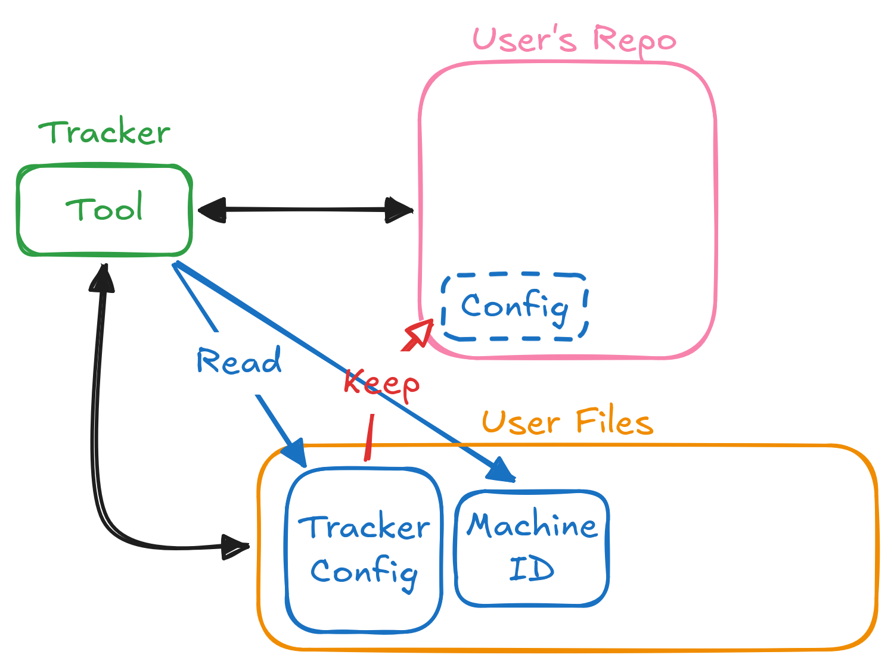

# FileKeeper
 This project main purpose is keeping important files of different machines up to date, allowing loading, unloading and comparing, based on the user's configuration.

 **NO** I won't use NixOS.

# TODO
- [ ] Add verbose and non-verbose options
    - Verbose shouldn't use the EntryTree structure
- [ ] Add the option to ignore hidden files
- [ ] Make a better print format for `check` (with colors)
- [ ] Simplify nested crate structure
- [ ] Handle errors properly
- [ ] Test, Test, Test
